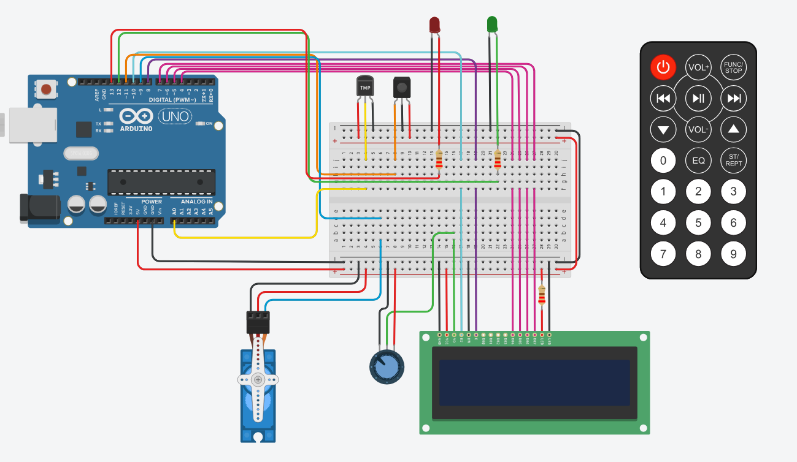

# Proyecto: Sistema de incendio con Arduino

## Descripcion
El objetivo de este proyecto es representar un sistema de incendio utilizando Arduino que pueda
detectar cambios de temperatura y activar un servo motor en caso de detectar un incendio.
Además, se mostrará la temperatura actual y la estación del año en un display LCD.
## Link del proyecto
* [proyectoSPD.com](https://www.tinkercad.com/things/2DxtuLpNRFq-segundo-parcial-schmidt-katerina-1d/editel?sharecode=DN3uTqkjpGEJzy43DkKnKDpiJsoMAcpQ-5ikfAPDwbc)
